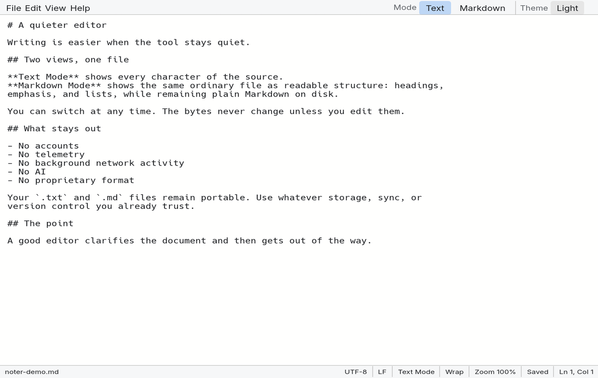
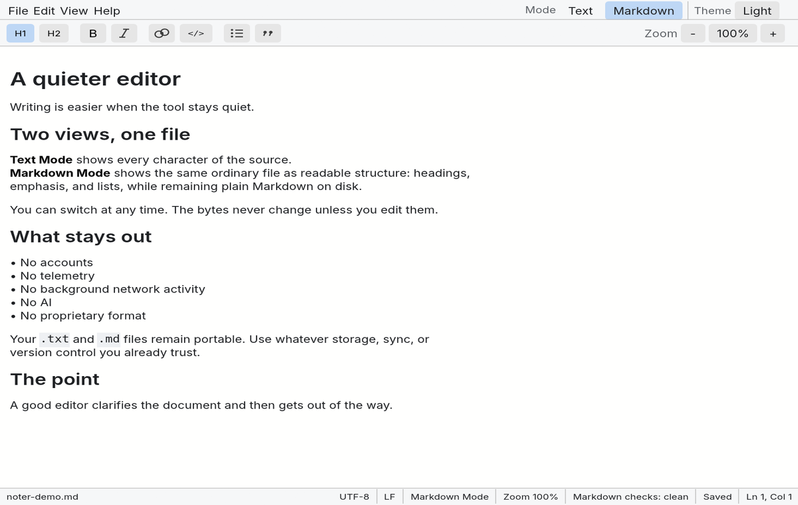
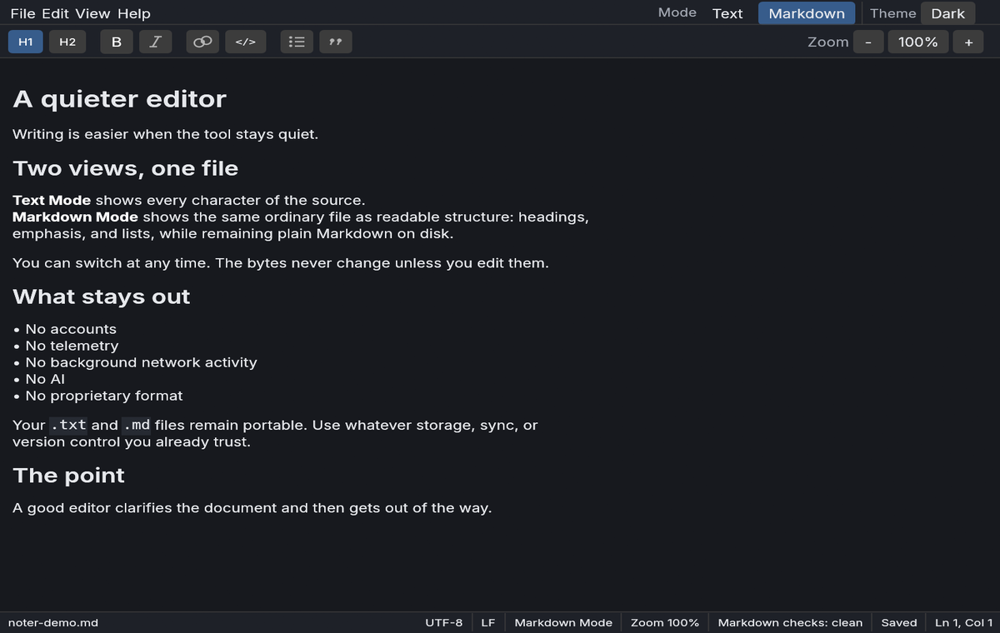
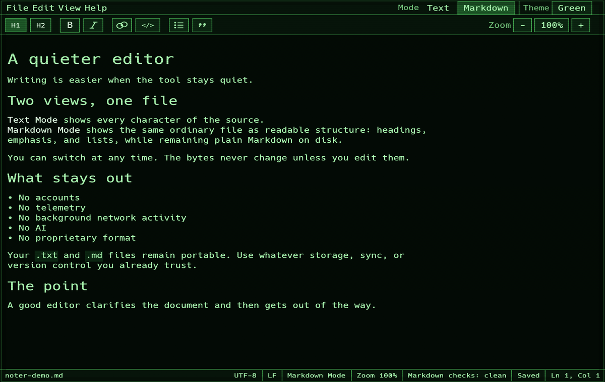
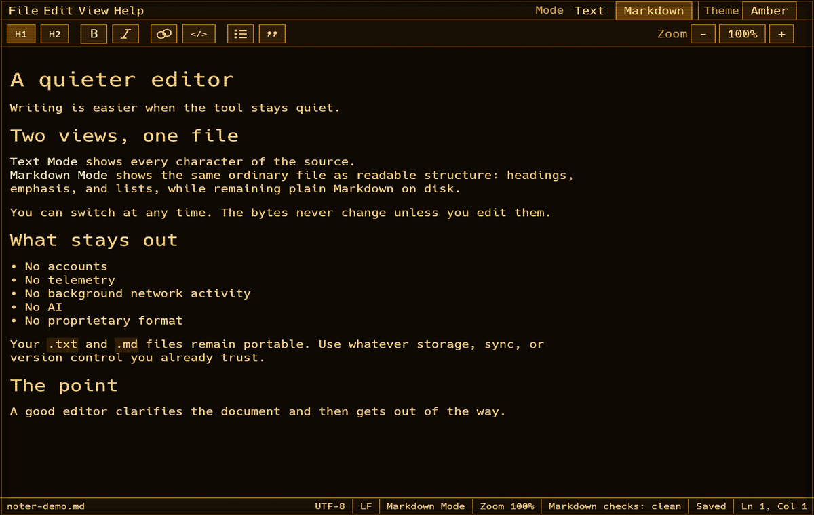

# Noter

[](https://github.com/blisspixel/noter/actions/workflows/ci.yml)

Noter is a private, cross-platform editor for plain text and Markdown, written
in Rust.

It is a compiled desktop application with a native window and GPU renderer. It
does not embed a WebView, browser engine, HTML or CSS interface, or JavaScript
runtime.

One document. Two exact views. Text Mode shows every source character. Markdown
Mode shows the same file as readable structure while keeping supported content
directly editable. Both views operate on one portable UTF-8 text or Markdown
file, and switching views never rewrites it.

No tracking. No activity logging. No usage analytics. No automatic crash
uploads. Noter stores ordinary local preferences such as theme, wrapping, and
zoom, but keeps no background history of what you write, which files you open,
or how you use the editor. The application rejects the spyware and bloatware
pattern of turning a small utility into an oversized data-collection product.
Those capabilities are absent, not hidden behind an opt-out.

There is no account, subscription, telemetry, advertising, cloud document
format, bundled AI, or remote content fetch while editing. Your files remain
portable `.txt` and `.md` files, ready to move between devices using whatever
storage, sync, or version-control tools you trust. The current application
makes no network request; even its update action only opens a local status
dialog unless you explicitly choose to open the releases page in your browser.

## Interface

### One file, two views

These captures show the identical local file in Text Mode and Markdown Mode.
The source bytes do not change when the view changes.

| Text Mode | Markdown Mode |
| --- | --- |
|  |  |

### Light, dark, and terminal themes

Each theme uses the same native text shaping, source-backed Markdown editor, and
deterministic demo file. Green Screen and Amber Screen are complete themes, not
filters over a generic dark capture.

| Dark | Green Screen | Amber Screen |
| --- | --- | --- |
|  |  |  |

## Install

Signed binary releases are not published yet. The current installer builds the
locked source checkout with the Rust toolchain pinned by the repository.
Install [Git](https://git-scm.com/) and
[Rust through rustup](https://rustup.rs/), then run the commands for your
platform.

Windows PowerShell:

```powershell
git clone https://github.com/blisspixel/noter.git
cd noter
.\scripts\install.ps1
```

macOS or Linux:

```sh
git clone https://github.com/blisspixel/noter.git
cd noter
sh scripts/install.sh
```

Start Noter with `noter`, or verify the installation with `noter --version`.
The [installation guide](docs/INSTALLATION.md) covers updates, custom install
locations, uninstallation, troubleshooting, and the future binary-release
contract.

## Project status

Today, the source build provides exact-source Text Mode, source-backed Markdown
Mode, Undo and Redo, Find and Replace, Go To Line, wrap, zoom, five themes, and
defensive local saves for ordinary UTF-8 `.txt` and `.md` files.

Noter remains an alpha while recovery, continuous Markdown interaction,
accessibility, platform filesystem evidence, and binary distribution are being
finished. Evaluate it with backups rather than making it the only editor for an
important file. The [roadmap](docs/ROADMAP.md) separates working behavior from
the evidence required for the first public-quality release.

## Documentation

- [Documentation index](docs/README.md)
- [Native Markdown Mode](docs/MARKDOWN.md)
- [Privacy contract](docs/PRIVACY.md)
- [Contributing](CONTRIBUTING.md)
- [Security policy](SECURITY.md)
- [Changelog](CHANGELOG.md)

## License

Noter is licensed under the [Apache License 2.0](LICENSE).
